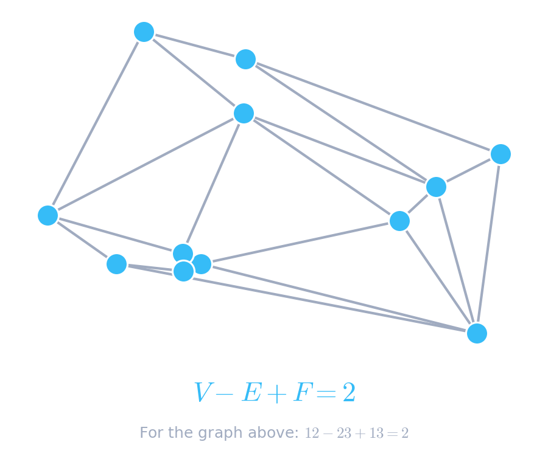

  

<h1 align="center">! Moin Moin , I'm Walid Kasab 👋</h1>

  

 

### 🌌 About Me

[cite_start]I am a mathematician and Game developer.

### 🧮 The Beauty of Math: Euler's Formula

In graph theory, elegance is everything. My absolute favorite mathematical truth is **Euler's Formula** for planar graphs. No matter how complex a network gets, as long as no edges cross, the relationship between its Vertices ($V$), Edges ($E$), and Faces ($F$) remains perfectly unbroken:

  <h2 align="center"> $$V - E + F = 2$$ </h2>
  
  
   
   
  
  

---

### 💻 Featured Projects

* [cite_start]**KRR Conjecture Formal Verification:** Formalizing the Kotzig-Ringel-Rosa (KRR) Conjecture proof by Gnang, E. K. (2022) using the Lean 4 interactive theorem prover[cite: 40, 41].
* [cite_start]**Slot Game Simulation Engine:** Built a Monte Carlo simulation engine in Python and C# running 10,000,000+ spins to validate return-to-player (RTP), hit rate, and volatility for complex slot game mechanics[cite: 42, 43, 45].

### 🛠️ Technical Arsenal

* [cite_start]**Programming:** Python, C#, JavaScript, C++, LaTeX, Mathematica [cite: 69]
* [cite_start]**Tools & Frameworks:** Lean 4, Unity Engine, TensorFlow, OpenCV, Git, Linux, Excel [cite: 70]

 

  <i>"Mathematics is the language in which God has written the universe." — Galileo Galilei</i>

